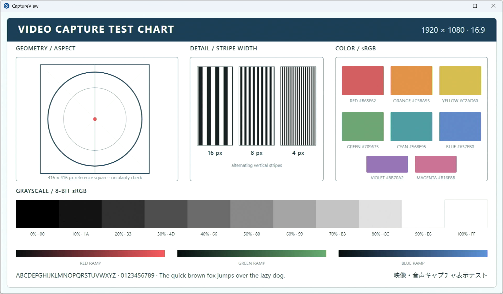
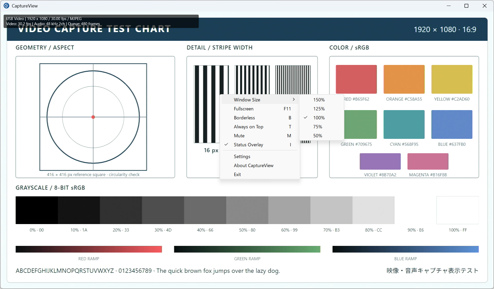
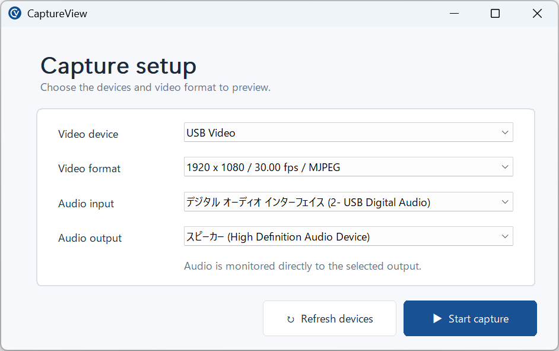

# CaptureView — UVC / USB Capture Viewer for Windows

[日本語](#japanese)

**A lightweight, focused UVC and USB capture card viewer for Windows.**

CaptureView lets you monitor video and audio from HDMI capture cards, USB video
capture devices, and UVC cameras without the complexity of recording or
streaming software.

It is built for the moments when you simply need to see and hear a capture
source—from game consoles and cameras to Raspberry Pi, FPGA, embedded systems,
microscopes, and other HDMI output devices connected through a compatible USB
capture device.

## Screenshots



<details>
<summary>Viewer controls and capture setup</summary>

<p align="center">
  
</p>

<p align="center">
  
</p>

</details>

## Get CaptureView

- [Microsoft Store](https://apps.microsoft.com/detail/9PNWC0R67PT0) — recommended
  for Store-managed installation and updates
- [GitHub Releases](https://github.com/hine/capture-viewer/releases) — portable
  x64 ZIP builds

## Why CaptureView?

Full recording and streaming suites are powerful, but they can be more than
necessary when the goal is simply to monitor a capture device.

CaptureView focuses on that job. It avoids recording, streaming, and scene
composition while retaining the practical controls needed for everyday
viewing: audio monitoring, fullscreen and always-on-top modes,
capture-relative sizing, flip correction, persistent settings, device
recovery, and a diagnostic report.

Everything you need to view a capture device. Nothing you don't.

## Use cases

- HDMI capture cards and USB video capture devices
- Game console monitoring
- Raspberry Pi and other single-board computers
- FPGA, microcontroller, and embedded-system development
- HDMI output testing and debugging
- UVC cameras, microscopes, and inspection cameras

## Features

- Native Win32 application with no third-party runtime libraries
- Media Foundation capture with native NV12, YUY2, RGB24, and MJPEG-to-NV12
  paths verified on hardware
- Independent WASAPI audio input and output selection
- Event-driven audio monitoring and live mute
- Normal, borderless, and fullscreen viewing modes
- Always-on-top mode and multiple simultaneous application instances
- Capture-relative window sizes: 50%, 75%, 100%, 125%, and 150%
- Per-monitor DPI awareness for physical-pixel-accurate 100% display
- Optional three-line status overlay for video FPS, audio format, and queue depth
- Persisted horizontal and vertical display correction
- Device refresh and graceful recovery when a capture device is disconnected
- User-reviewable diagnostic report for hardware and capture troubleshooting
- Persistent device, format, window, and viewer settings

## Requirements

To run:

- Windows 10 or Windows 11, x64
- A UVC-compatible video capture device
- Optional WASAPI-compatible audio input and output devices

To build:

- Visual Studio 2022 Build Tools with **Desktop development with C++**
- Windows 10 or Windows 11 SDK
- CMake 3.24 or later

## Build

Run from a Developer PowerShell configured for MSVC:

```powershell
cmake -S . -B build -A x64
cmake --build build --config Release
```

The executable is generated at `build/Release/CaptureView.exe`. CaptureView
currently uses only Windows system APIs and does not depend on third-party
runtime libraries.

See [Building CaptureView](docs/build.md) for minimal environment setup,
Ninja-based builds, and troubleshooting when Windows blocks a locally built
executable.

## Controls

| Input | Action |
|---|---|
| Right click | Open the viewer menu |
| `F11` / `Alt+Enter` | Toggle fullscreen |
| `Esc` | Leave fullscreen |
| `B` | Toggle borderless mode |
| `T` | Toggle always on top |
| `M` | Mute or unmute audio monitoring |
| `I` | Toggle the status overlay |

The **Window Size** submenu changes the client area relative to the capture
resolution. The selected size and window position are restored for the same
capture resolution. Selecting a different capture resolution resets the window
to 100%; manual resizing is stored as **Custom**.

Settings and logs are stored under `%LOCALAPPDATA%\CaptureView\`.

Choose **Diagnostic Report** from the right-click menu to review and copy a
plain-text summary for a support request. The report is generated only when
requested and includes device friendly names, device-advertised and negotiated
video formats, renderer information, live statistics, settings, and recent errors.
It is never sent automatically and intentionally omits device IDs, serial
numbers, account names, and file paths. Review the text before sharing it. The
copy action shows a completion message and leaves the report window open until
**Close** is selected.

Some capture devices deliver video upside down or horizontally mirrored, or
report orientation metadata that does not match the delivered image. The
right-click **Flip** submenu provides independent horizontal and vertical
display correction for these inputs. The correction is saved and does not
modify the source signal.

## Troubleshooting capture stalls

Hardware-dependent UVC device or driver behavior has been observed where a
device stops delivering frames after changing between advertised video formats,
even though Media Foundation accepted the new format successfully. In the
verified case, Source Reader callbacks stopped before frames reached
CaptureView's conversion, flip, or rendering code; it was not caused by those
image-processing paths. CaptureView detects two seconds without a Source Reader
callback, stops the stalled capture, and returns to setup with an error instead
of remaining on an unresponsive black viewer. Try another format and then
select the desired format again. If capture still does not resume,
disconnecting and reconnecting the USB capture device is likely to reset its
internal video state.

## Permissions and privacy

CaptureView uses camera access to receive video from the selected capture
device and microphone access to monitor the selected audio input. The Microsoft
Store version may show Windows permission prompts when these features are first
used. CaptureView processes media locally and does not record, stream, upload,
or otherwise transmit captured video or audio.

See the [CaptureView Privacy Policy](PRIVACY.md) for details about permissions,
local settings and logs, and data removal.

## Development

CaptureView was created with the help of AI. Product decisions, scope, hardware
testing, and acceptance of the implementation are performed by the developer.
See the [implementation status](docs/status.md) for verified hardware coverage
and current development details.

## License

Source code and documentation are available under the [MIT License](LICENSE):

```text
Copyright (c) 2026 hine
```

The CaptureView name, logo, and icon files are reserved brand assets and are
not covered by the MIT License. Unmodified CaptureView builds may use them;
forks and derived products must use their own name and visual identity. See
[assets/README.md](assets/README.md).

---

<a id="japanese"></a>

# CaptureView — Windows向けUVC／USBキャプチャービューアー

**USBキャプチャーデバイスを「見る」ことに集中した、軽量なWindows用ビューアーです。**

HDMIキャプチャーボード、USBビデオキャプチャーデバイス、UVCカメラの映像と
音声を、録画・配信ソフトの複雑な設定なしでモニタリングできます。

ゲーム機やカメラだけでなく、Raspberry Pi、FPGA、組み込み機器、顕微鏡、
その他のHDMI出力機器を、対応するUSBキャプチャーデバイス経由で手軽に確認
したい場面を想定しています。

## 入手方法

- [Microsoft Store](https://apps.microsoft.com/detail/9PNWC0R67PT0) —
  Storeによるインストールと更新を利用する推奨版
- [GitHub Releases](https://github.com/hine/capture-viewer/releases) —
  ポータブルx64 ZIP版

## CaptureViewを作った理由

録画・配信ソフトは高機能ですが、目的がキャプチャーデバイスの映像と音声を確認
することだけなら、必要以上に大きな仕組みになる場合があります。

CaptureViewはその用途に集中しています。録画、配信、シーン合成を持たない一方、
音声モニタリング、フルスクリーン、常に手前に表示、キャプチャー解像度基準の
サイズ指定、反転補正、設定保存、デバイス復旧、診断レポートなど、日常的な表示に
必要な機能を備えています。

「見るだけ」に、ちょうどいい。

## 用途例

- HDMIキャプチャーボード、USBビデオキャプチャーデバイス
- ゲーム機の映像・音声確認
- Raspberry Piなどのシングルボードコンピューター
- FPGA、マイコン、組み込み機器の開発
- HDMI出力機器の動作確認・デバッグ
- UVCカメラ、顕微鏡、検査用カメラ

## 特徴

- 外部ランタイムライブラリを必要としないWin32ネイティブアプリケーション
- Media Foundationによる映像キャプチャ（ネイティブNV12・YUY2・RGB24、
  MJPEGからNV12へのデコードを実機確認済み）
- WASAPI音声入力・出力の独立選択
- Event Driven方式による音声モニタリングとミュート
- 通常、ボーダーレス、フルスクリーン表示
- Always on Topとアプリケーションの複数同時起動
- キャプチャ解像度基準の50%・75%・100%・125%・150%表示
- 100%表示で物理ピクセルを一致させるPer-Monitor DPI対応
- 映像FPS、音声形式、キュー深度を示す3行ステータスオーバーレイ
- 保存可能な上下・左右の表示反転補正
- デバイス一覧の更新と、切断時の設定画面への復帰
- ハードウェアやキャプチャ問題の報告に利用できる、内容確認可能な診断レポート
- デバイス、フォーマット、ウィンドウ、表示設定の保存

## 動作環境

実行環境：

- Windows 10またはWindows 11（x64）
- UVC互換の映像キャプチャデバイス
- 必要に応じてWASAPI互換の音声入力・出力デバイス

ビルド環境：

- Visual Studio 2022 Build Toolsの「C++によるデスクトップ開発」
- Windows 10またはWindows 11 SDK
- CMake 3.24以降

## ビルド

MSVCを利用できるDeveloper PowerShellで実行します。

```powershell
cmake -S . -B build -A x64
cmake --build build --config Release
```

`build/Release/CaptureView.exe`が生成されます。現在のCaptureViewはWindowsの
システムAPIだけを使用し、第三者製のランタイムライブラリには依存しません。

最小構成の環境導入、Ninjaを使うビルド、自分でビルドしたEXEがWindowsに
ブロックされた場合の確認手順は[CaptureViewのビルド](docs/build.md#japanese)を
参照してください。

## 操作

| 入力 | 動作 |
|---|---|
| 右クリック | ビューアーメニューを表示 |
| `F11` / `Alt+Enter` | フルスクリーン切替 |
| `Esc` | フルスクリーン解除 |
| `B` | ボーダーレス切替 |
| `T` | Always on Top切替 |
| `M` | 音声モニタリングのミュート切替 |
| `I` | ステータスオーバーレイ切替 |

右クリックメニューの**Window Size**では、キャプチャ解像度に対して50%・75%・
100%・125%・150%のクライアントサイズを選べます。同じキャプチャ解像度では
選択倍率とウィンドウ位置を復元し、解像度を変更すると100%へ戻ります。手動で
リサイズした場合は**Custom**として保存します。

設定とログは`%LOCALAPPDATA%\CaptureView\`に保存されます。

右クリックメニューの**Diagnostic Report**を選ぶと、問い合わせに添付できる
プレーンテキストの診断情報を確認してコピーできます。この情報は操作したときだけ
生成され、デバイスの表示名、提示・確定映像フォーマット、描画情報、動作統計、設定、
直近のエラーを含みます。自動送信は行わず、デバイスID、シリアル番号、アカウント名、
ファイルパスは意図的に収集しません。共有する前に内容を確認してください。
コピーすると完了メッセージが表示されます。レポート画面は**Close**を選ぶまで
閉じません。

一部のキャプチャデバイスでは、入力映像が上下反転または左右反転していたり、通知
される向きの情報と実際の映像が一致しなかったりする場合があります。右クリック
メニューの**Flip**では、このような入力に対して上下・左右を個別に表示補正できます。
補正設定は保存され、入力元の映像信号そのものは変更しません。

## 映像が停止した場合

一部のUVCデバイスでは、デバイスが列挙した映像フォーマット間を切り替えた際、
新しいフォーマットをMedia Foundationが正常に受理していても、ハードウェアまたは
ドライバー依存の挙動によりフレーム供給が停止することが確認されています。実機で
確認したケースでは、CaptureViewの色変換、反転、描画処理へフレームが届く前に
Source Readerのコールバックが停止しており、これらの画像処理が原因ではありません。
CaptureViewはコールバックが2秒間届かなければ停止を検出し、応答しない黒画面を
残さずエラーを表示して設定画面へ戻ります。別のフォーマットを一度選んでから目的の
フォーマットを選び直してください。それでも復旧しない場合は、USBキャプチャデバイス
を抜き差しすると、デバイス内部の映像状態がリセットされて復旧する可能性が高いです。

## 権限とプライバシー

CaptureViewは、選択したキャプチャデバイスから映像を受け取るためにカメラアクセス、
選択した音声入力をモニタリングするためにマイクアクセスを使用します。Microsoft
Store版では、これらの機能を初めて使用するときにWindowsがアクセス許可を求める
場合があります。映像と音声は端末内で処理され、録画、配信、アップロード、その他
の外部送信は行いません。

権限、ローカルの設定・ログ、データ削除については
[CaptureViewプライバシーポリシー](PRIVACY.md)を参照してください。

## 開発について

CaptureViewはAIの力を借りて開発しています。
製品の方向性、機能範囲、実機テスト、実装結果の受け入れ判断は開発者が行っています。
実機確認済みの範囲と現在の開発状況は[実装状況](docs/status.md)を参照してください。

## ライセンス

ソースコードと文書は[MIT License](LICENSE)で公開します。

```text
Copyright (c) 2026 hine
```

CaptureViewの名称、ロゴ、アイコンファイルはブランド資産であり、MIT Licenseの
対象外です。無改変のCaptureViewをビルド・配布する用途では使用できますが、
フォークや派生製品では独自の名称と外観を使用してください。詳細は
[assets/README.md](assets/README.md)を参照してください。
